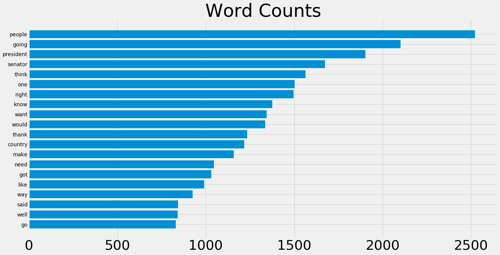
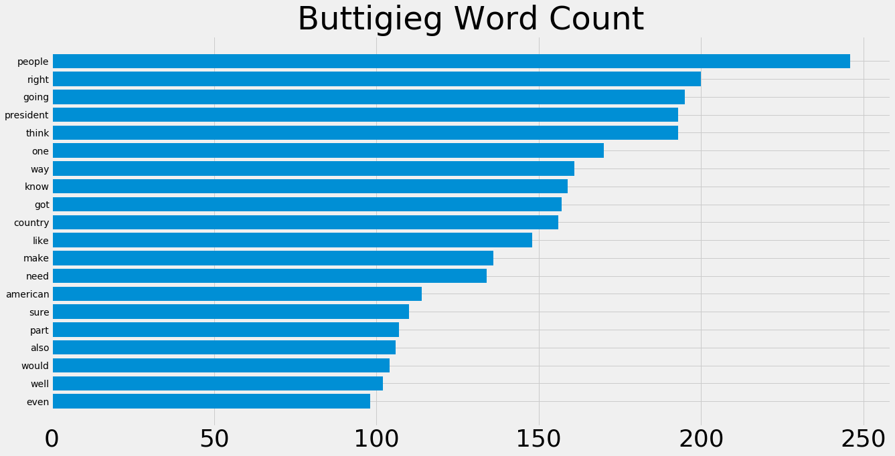
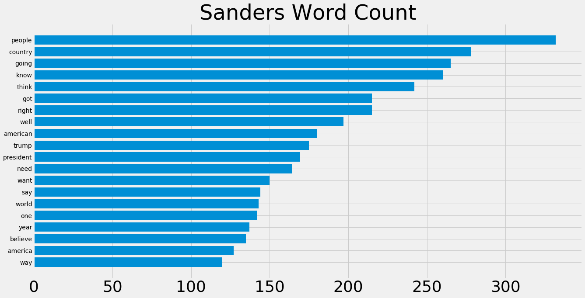
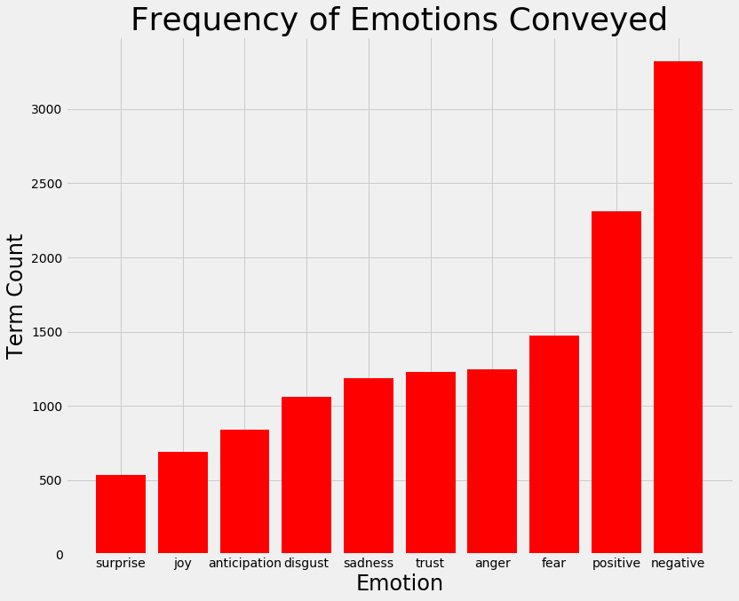
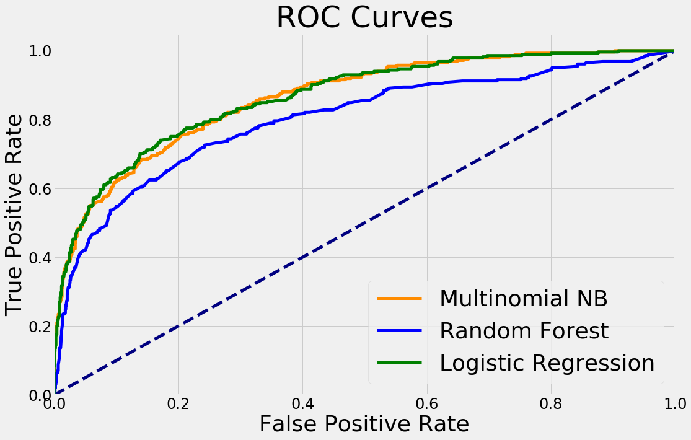
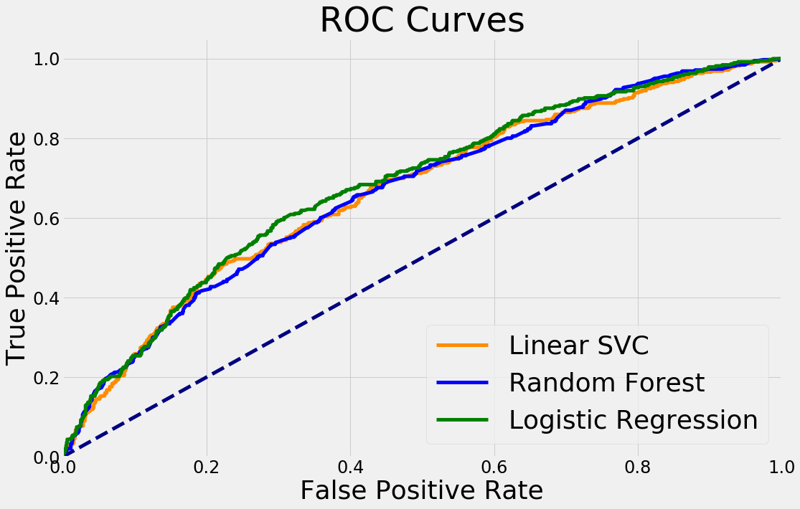

# Exploring the Election
## Motivation
At the time of this project the 2020 Presidential Election is in full swing as Democratic candidates are all vying for the nomination and the opportunity to campaign against President Trump as the new term approaches. Having previously analyzed the 2016 election, I wanted to explore on a deeper level the 2020 election and how the Democratic candidates have approached this race.

While Twitter is and has been a popular medium to understand candidate performance, I wanted to directly analyze their public appearances to see how important their showing may be.

## The Data
Over 30 transcripts of both debates and town hall appearances were webscraped from CNN and Rev, equating to over 10,000 manually created rows, containing one or many sentences by speaker. Candidates selected for this analysis include: Biden, Sanders, Klobuchar, Buttigieg, and Warren. Candidates involved in Primary Debates were also included as well, such as Castro and Harris.

## Exploratory Data Analysis

Lines were preprocessed for analysis, with punctuation and stopwords removed. Words were then stemmed. The following plots show the word counts for every candidate, and for a select few candidates.

### Total:

### Individual Candidates:

Some Sentiment Analysis was also conducted to detect the general rhetoric of the candidates. Emotions were compared using the NRC Lexicon, involving thousands of words given an association with 8 different emotions as well as a polarity index.

 Noticeably, negative terms appear much more often than positively associated terms. Anger and fear are common campaign strategies when a party is no longer in the forefront, which is reflected in this analysis.

### Topic Analysis
 Finally, some topic analysis was conducted as well to try and determine what issues are prominent in this election. Three topics are shown below:

 |Topic|Key Words|
 -----|-|
 |Topic 1| american countri peopl becaus job know money need right way|
 |Topic 2| colorado stimul ferguson humanitarian co2 thrive 180 loser malpractic delaney|
 |Topic 3|countri texa everyon member law challeng el paso face ensur|

 These topics imply some larger issues are being discussed. Topic 1 may involve the heavy focus on jobs, infrastructure, and the economy. Topic 2 may focus on the environment and pollution. Topic 3 implies a discussion on gun laws and the recent tragedies and killings.

 ## Analysis
 The goal of this project is to eventually create a recommender for candidates to develop their campaign strategies and focus on states in which they do not have to adjust heavily. In other words, suggesting to candidates which states they do not have to allocate as much resources in researching and shifting their positions while also shaping their strategies based off of previous successful candidates.

 Before the recommender system can be implemented, I first implemented a classification model to determine if the data is distinct enough to be classified instead of every data point being recommended due to their similarities.

 The first model attempts to classify Bernie Sanders compared to his fellow candidates. Sanders was chosen due to his previous performance to date of the analysis.

 

 Both Logistic Regression and Multinomial Naive Bayes models produced an F1 Score and Precision of .86 with a Recall score of .87.

 State Classification performed somewhat worse, but still decent enough results to be confident that some analysis is valid.

 

All three scores - Accuracy, Precision, Recall - were around the .70 mark, which is still a strong result.

 In the future, the confusion matrices along with the actual Precision Recall Curves will be portrayed as well.

After it was determined that a Recommender could be made, I looked towards the Speakers to determine their similarities.

------
|Candidate | Recommended Candidates |
|----|-|
| Sanders| Warren, Buttigieg, Klobuchar |
|Biden| Warren, Buttigieg, Klobuchar|
|Yang| Booker, Warren, Buttigieg|
|Booker|Buttigieg, Harris, Warren|

Candidates who have performed well so far tend to be recommended to similar performing candidates. Some candidates are recommended fairly commonly, hinting that policies are very similar among the candidates and that anydistinction may not necessarily be the most significant.

State Recommendations followed, with the following results:
------
|State|Recommended State|
|-|-|
|Iowa| New Hampshire, California, Ohio|
|Michigan| Ohio, Texas, Florida|
|Florida| Ohio, Texas, California|
|New York| New Hampshire, Iowa, California|

In similar fashion, there are certain states that appear frequently, indicating that important state-issues may actually be common ground in these states, regardless of their voting patterns.

# Future Steps
While I was able to produce some Classification and Recommendation results, I would like to bridge the separate analyses on states and candidates into one unified model and finding. I would like to see if there is a relation between a candidates rhetoric, the state, and the previous successor's tactics. Using public speeches was an interesting view into their strategies, but involving more instances of audience reaction and public feedback would allow for more in depth analysis and an actual look into the effectiveness of the candidates' speeches. With more data, more models and deep learning methods can be used to produce findings that would contribute to this exploration. 